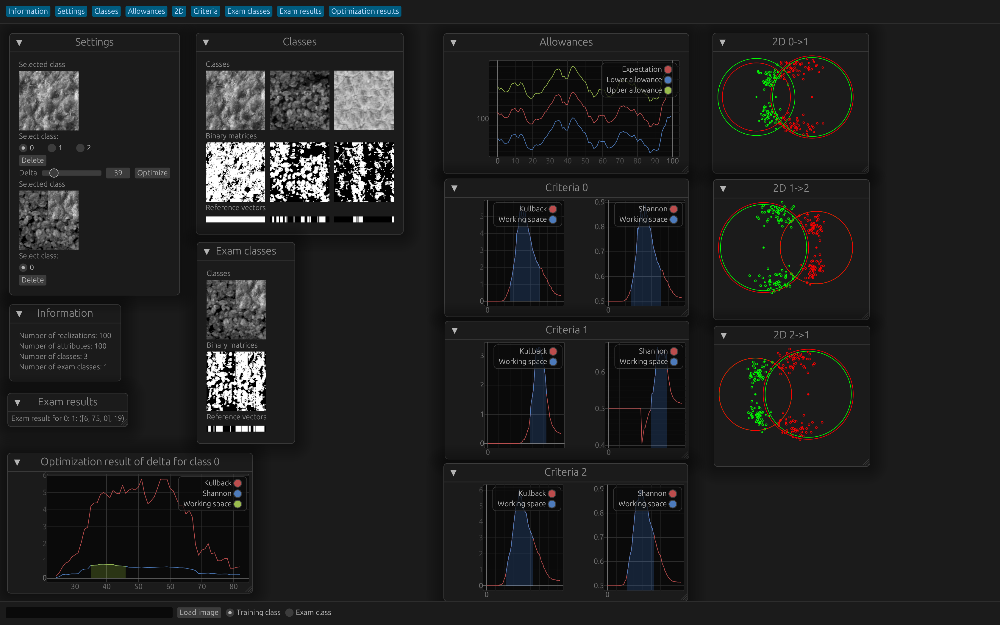

# tm

Eframe egui app for reviewing training matrices

## GUI

Example with two loaded images (1.bmp and 2.bmp in images directory).

## Features

- Calulation of binary matrices and reference vectors.
- Manual and [automatic](#automatic-delta-selection) delta selection.
- Plotting of expectation with allowances.
- Selection of base class.
- Loading and deleting classes from bmp files.
- 2D representation of classes as circles with claculated radius and dots as realizations of classes.
- Calculation and plotting of Kullback and Shannon criteria.
- Performing an exam on loaded exam classes. Determines what class it belongs to.

### Automatic delta selection

Optimizes delta by Shannon criteria of selected class and its closest neighour.

### Loading classes

Classes are loaded by treir paths (relative or absolute).

### Plots
Plots are made using egui_plot library.

## Dark/Light theme

Application respects OS theme.
